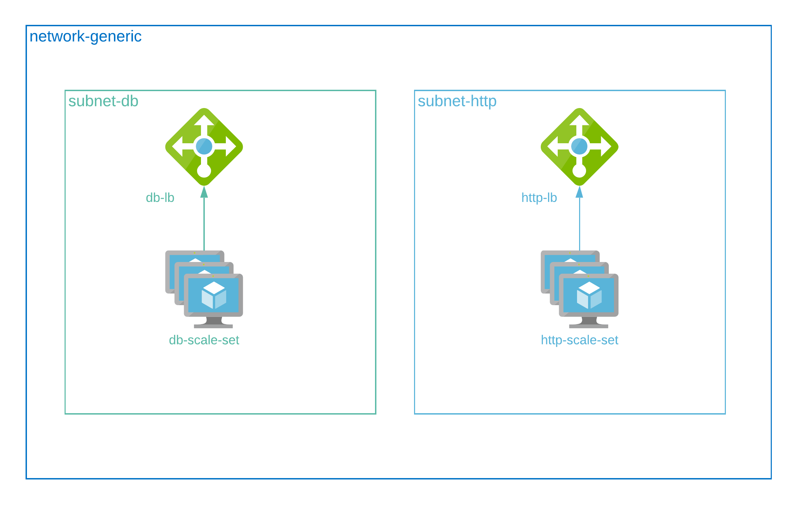

# How to



### Create stack

```
terraform apply
```

This script will create:
-   1 network
-   2 subnets
-   2 scale set
-   2 autoscale setting
-   2 load balancer

### Delete stack

```
terraform destroy
```
